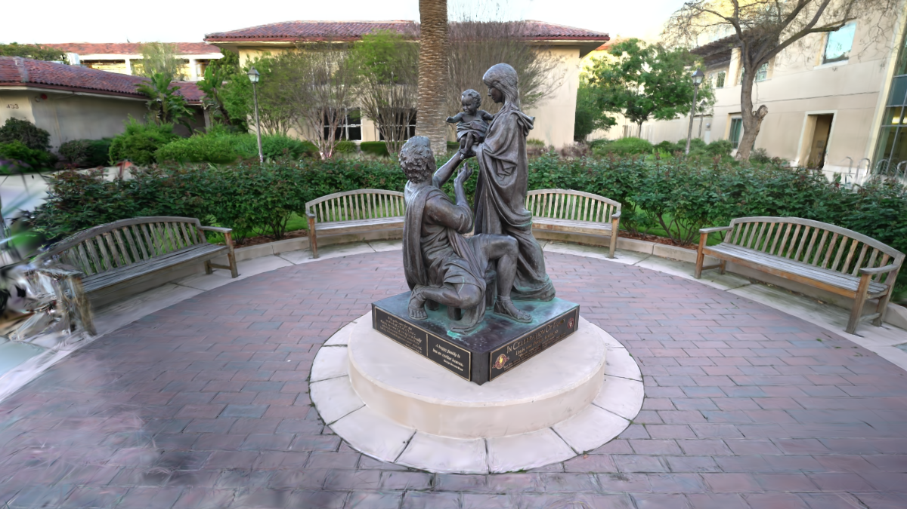
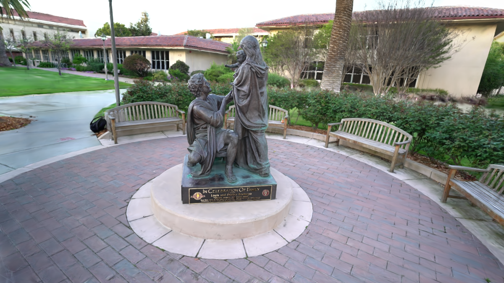
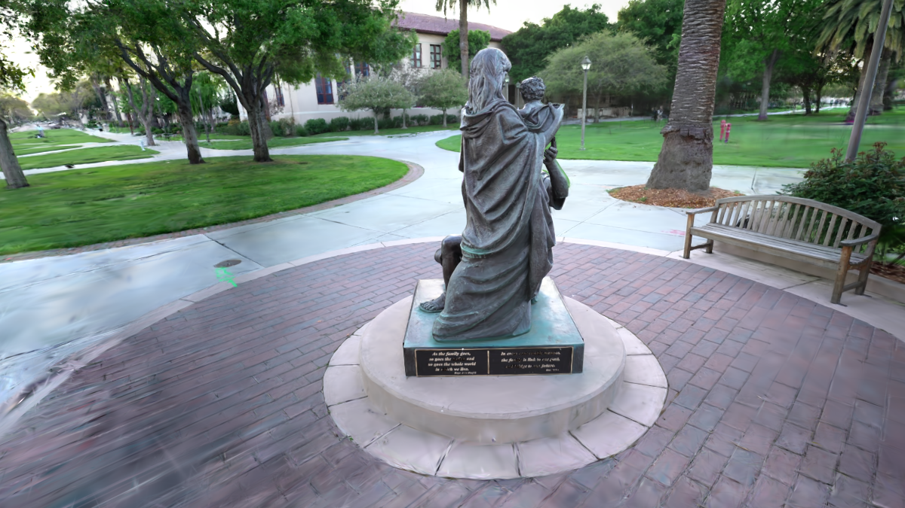
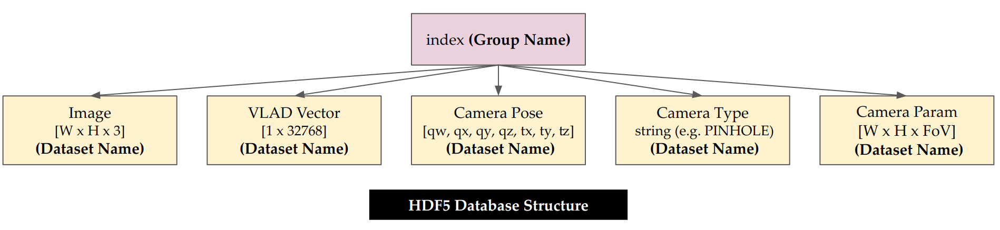
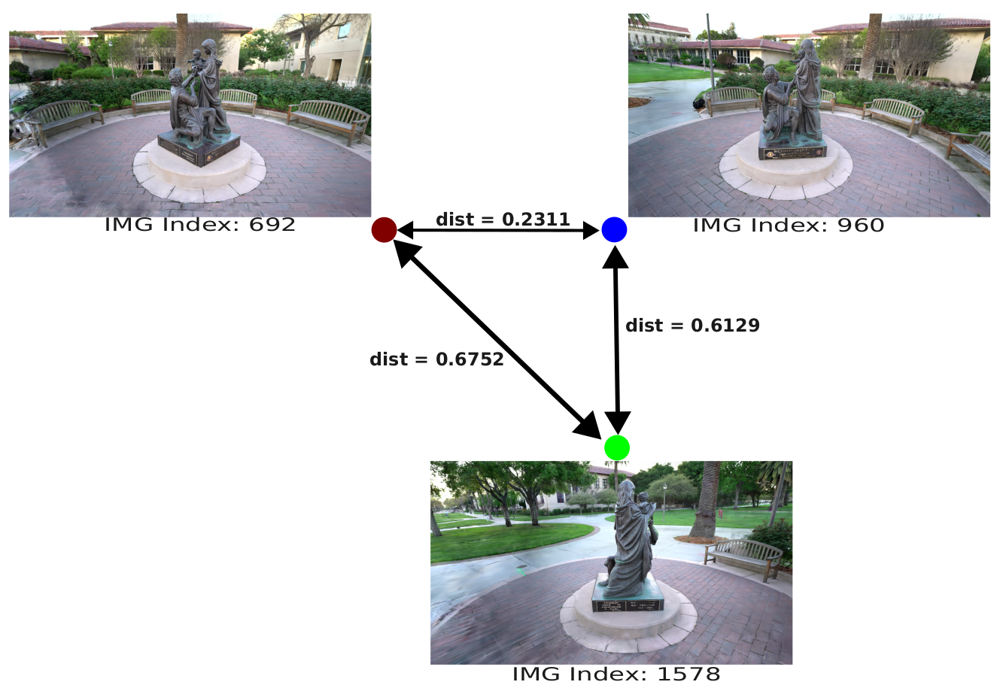

# Rendered Database
## Make Rendered Database using Rendered Image Obtained by Trained 3D Gaussian Splatting 
### Get Rendered Image using 3D Gaussian Splatting Rasterization
- Benchmark Dataset &rarr; Tanks and Temples
<table>
      <tr>
         <td> Render Img1 (Novel View Synthesis) </td>
         <td> Render Img2 (Novel View Synthesis) </td>
         <td> Render Img3 (Novel View Synthesis) </td>
      </tr> 
      <tr>
         <td> </td>
         <td> </td>
         <td> </td>
      </tr>
</table>

---
### Prerequisites
1. [3D Gaussian Splatting](https://github.com/graphdeco-inria/gaussian-splatting)
2. [NetVLAD Pytorch](https://github.com/deepshwang/NetVLAD_pytorch)
3. [Faiss](https://github.com/facebookresearch/faiss)
4. [Anaconda](https://www.anaconda.com/)
5. [OpenCV with Contrib](https://github.com/opencv/opencv)

---
### Preparing Dataset (in example folder)
(1) cameras.txt &rarr; [IMAGE_ID, CAMERA TYPE, IMAGE Width, IMAGE HEIGHT, ~] \
(2) images.txt &rarr; [IMAGE_ID, QW, QX, QY, QZ, TX, TY, TZ, CAMERA_ID, NAME] \
(3) image folder 

---
### Combined Preparing Dataset (Make KeyFrame DB)
- Using NetVLAD Method to make global descriptor
  - **KeyFrame = {Index, Image, VLAD, Camera Pose, Camera Type, Camera Params}**

- Final Database Extension file is HDF5 \
  

---
### Example Results (Find the Nearest Distance using Faiss obtained by VLAD vector)

