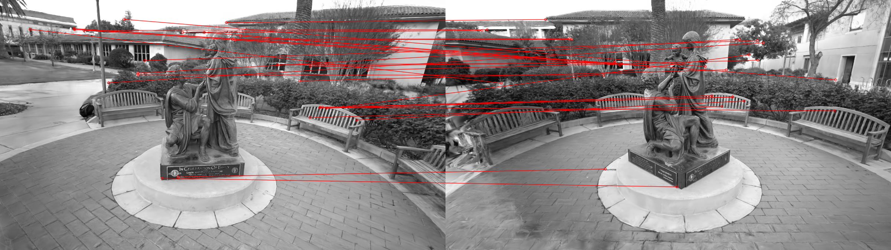
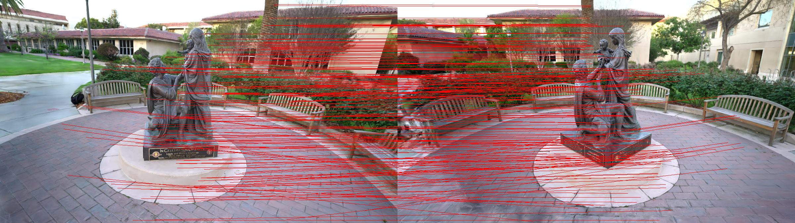

# Rendered Database
## [Goal] Make Rendered Database using Rendered Image Obtained by Trained 3D Gaussian Splatting 
### Get Rendered Image using 3D Gaussian Splatting Rasterization
- Benchmark Dataset &rarr; Tanks and Temples
<table>
      <tr>
         <td> Render Img1 (Novel View Synthesis) </td>
         <td> Render Img2 (Novel View Synthesis) </td>
         <td> Render Img3 (Novel View Synthesis) </td>
      </tr> 
      <tr>
         <td> </td>
         <td> </td>
         <td> </td>
      </tr>
</table>

---
### Prerequisites
1. [3D Gaussian Splatting](https://github.com/graphdeco-inria/gaussian-splatting)
2. [NetVLAD Pytorch](https://github.com/deepshwang/NetVLAD_pytorch)
3. [Faiss](https://github.com/facebookresearch/faiss)
4. [Anaconda](https://www.anaconda.com/)
5. [OpenCV with Contrib](https://github.com/opencv/opencv)
6. [RoMa](https://github.com/Parskatt/RoMa.git)
7. [LightGlue](https://github.com/cvg/LightGlue.git)
8. [SuperPoint](https://github.com/rpautrat/SuperPoint.git)
9. [Feature Matching](https://github.com/SungJaeShin/Feature_matching.git)

---
### Download pre-trained model
Download pre-trained model
- https://drive.google.com/drive/folders/1vhsYBUaxEPKSiBWgKTnHsH700aiTtPjA?usp=sharing

---
### Preparing Dataset (in example folder)
(1) cameras.txt &rarr; [IMAGE_ID, CAMERA TYPE, IMAGE Width, IMAGE HEIGHT, ~] \
(2) images.txt &rarr; [IMAGE_ID, QW, QX, QY, QZ, TX, TY, TZ, CAMERA_ID, NAME] \
(3) image folder 

---
### Combined Preparing Dataset (Make KeyFrame DB)
- Using NetVLAD Method to make global descriptor
  - **KeyFrame = {Index, Image, Keypoints, Descriptor(local or global), Camera Pose, Camera Type, Camera Params}**

- Final Database Extension file is HDF5 \
  

---
### Method of Keypoint and Descriptor (in `config.yaml`)
- **extractor_method** (`extractor_utils.py`):
   - 0 &rarr; apply ORB
   - 1 &rarr; apply SIFT
   - 2 &rarr; apply AKAZE
   - 3 &rarr; apply SuperPoint Model
   - `roma_based_extractor` function &rarr; apply RoMa Model

- **descriptor_method** (`extractor_utils.py`): 
   - 0 &rarr; apply ORB
   - 1 &rarr; apply SURF
   - 2 &rarr; apply DAISY
   - 3 &rarr; apply AKAZE
   - 4 &rarr; apply SuperPoint Model

- **matcher_mode** (`matching_utils.py`):
   - `calculate_score` function &rarr; apply BF Matcher (Brute-Force) + KNN Matches
   - `roma_based_extractor` function &rarr; apply RoMa Model
   - `lightglue_matcher` function &rarr; apply LightGlue Model

- **REJECTION_MODE** (using `cv2`):
   - apply cv2.fundamentalMatrix 
   

---
### Example Results
- (1) Find the Nearest Distance using Faiss obtained by VLAD vector (Find Candidates)
      

- (2) Find Feature Matching using Local Descriptor (Finda the Best Candidates)
      <table>
            <tr>
               <td> Matching Results (ORB + DAISY + distance=0.99) </td>
            </tr> 
            <tr>
               <td>  </td>
            </tr>
            <tr>
               <td> Matching Results (RoMa indoor + reproj=0.01) </td>
            </tr>
            <tr>
               <td>   </td>
            </tr>
      </table>

